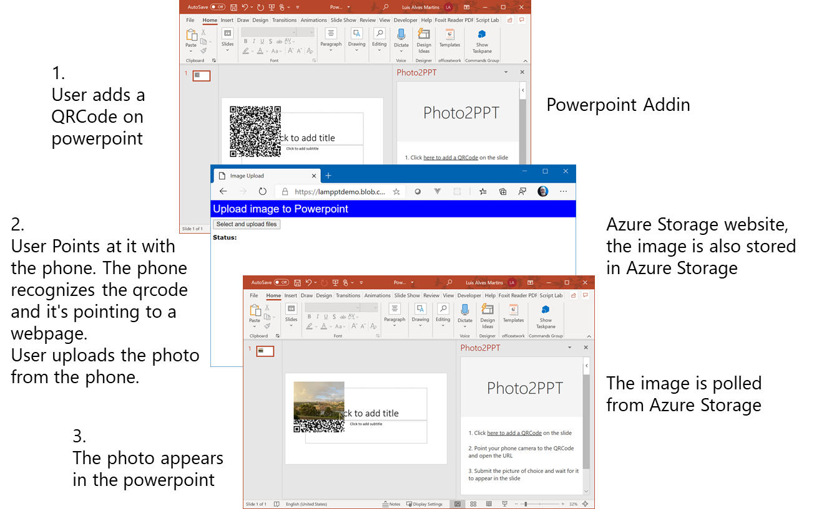

# Phone2PPT
Send pictures from the phone directly to a slide in PPT

Spent some of my free time in the weekend doing an addin for Powerpoint to transfer a photo from my phone to a powerpoint slide. Without copy and paste, onedrive, email, etc.

 

The story goes like this: 
- Using the addin a QRCode is displayed in the task pane. User points at it with the phone camera. The phone recognizes the qrcode (it's pointing to a webpage)
- User uploads the photo using the website from the phone.
- The photo appears automagically in the powerpoint.

In an image:

## Steps to test it

- Goto www.office.com 
- open a new powerpoint document 
- do Insert
- Select Add-ins
- Manage My Add-ins
- Use "Upload my add-in"
- Point to: https://raw.githubusercontent.com/luisalvesmartins/Phone2PPT/master/PhotoAdd/manifest.xml
- Open the taskpane and test it

## Steps to deploy 

Deploy website in Azure Storage:

- Create Azure Storage Account
- Create a SAS for the container
- on imageupload.html fill *accountName*, *sasString* and *containername*
- Copy the content of HTMLStorage to a public container

Change the addin

- Point the addin to the Azure Storage Website and upload container, line 1 of PhotoAdd/src/taskpane/taskpane.js. Change content of BACKENDURL and BACKENDFOLDER vars.

Run

In the addin folder start the addin by doing: npm start

Note: QRCode source dropped in for easiness 